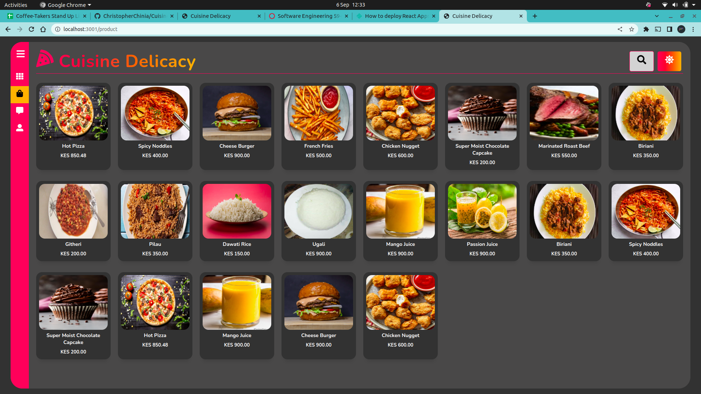
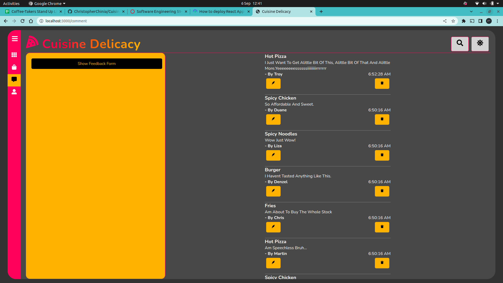
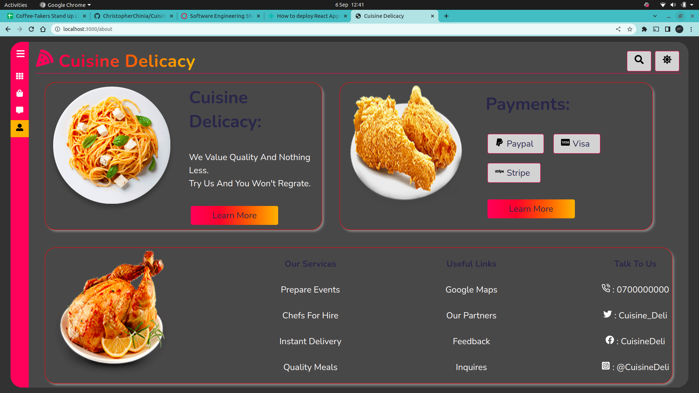

# Cuisine Delicacy
*****
### Author : Christopher Chinia 7th September 2022
****
## Project Description
Cuisine Delicacy is a web application that provides its client a way to rate its dishes and give feedback. Created using React javascript for frontend and  Ruby for backend. The application provides a simple yet elegant user interface and user experience.

## SCREENSHOTS


 







********
## SetUp Instruction
Run this command to get the frontend started:
```sh
3. In a new terminal,run `npm install` in your terminal.
4. Then, run `npm start`. This will run your React app on port `3000`.
```
Run this command to get the backend started:

```sh
1. Run `bundle install` in your terminal.
2. Run `bundle exec rake server` in your terminal.This will run your backend on port `9292`.

Make sure to open [http://localhost:9292/comments](http://localhost:9292/comments) in the browser to verify that your backend is working before you proceed!

The base URL for your backend is: `http://localhost:9292`
```


### Requirements
* [HTML](lang Url)
* Text editor eg [Visual Studio Code](https://code.visualstudio.com/download)


### Getting Files
* Fork the frontend repo [LINK.](https://github.com/ChristopherChinia/CuisineDeli-client.git)
* Fork the backend repo [LINK.](https://github.com/ChristopherChinia/CuisineDelicacy-Server.git)
- Create a new branch in your terminal (git checkout -b improve-feature)
- Install the prerequisites
- Make appropriate changes in file(s)
- Run the server to see the changes
- Add the changes and commit them (git commit -am "Improve App")
- Push to the branch (git push origin improve-app)
- Create a Pull request
* Open the folder location on terminal and use the following command to run app:

## How To Run It
Run this command to get the backfront started:

```sh
npm install
```

```sh
npm start
```
Make sure to run this command exactly as written,
otherwise your server will
not return data in the correct format. Test your server by visiting this route
in the browser:

[http://localhost:3000](http://localhost:3000)

Run this command to get the backend started:

```sh
bundle install
```

```sh
bundle exec rake server
```
Make sure to run this command exactly as written,
otherwise your server will
not return data in the correct format. Test your server by visiting this route
in the browser:

[http://localhost:9292](http://localhost:9292/comments)

*****
## Live Link
Or you can access the web application directly via this [LINK.]() 
*****

## Technologies Used
1. HTML
2. CSS
3. JavaScript(React js)
4. Netlify
5. Glitch
6. 


*****
## Contact Information
* Email : christopher.chinia@student.moringaschool.com
*****
## [License](LICENSE)
MIT License
Copyright (c) 2022 Christopher Chinia